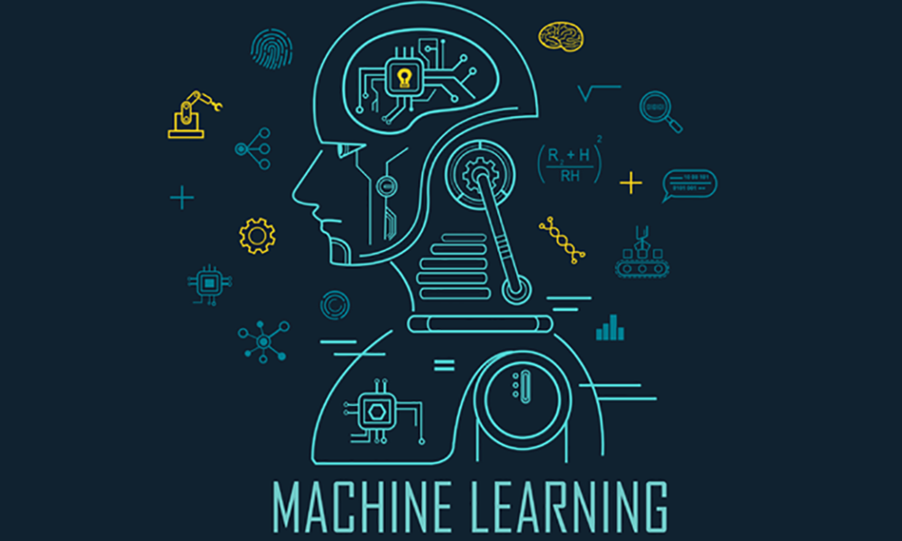

# Data Science with Kaggle

A GitHub repo to save and journalize my learning experience on Kaggle.

---

I am currently learning! Please feel free to share any tips or optimizations that you find!

So far I have done:
* Intermediate Machine Learning
  * Missing Values
---

